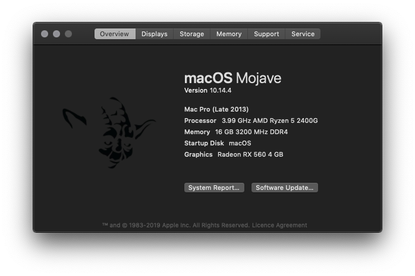

# Welcome to AMD OS X Vanilla

## Gathering Resources :-

What you'll need,

* gibMacOS - A awesome tool from CoptNewt \( [https://github.com/corpnewt/gibMacOS](https://github.com/corpnewt/gibMacOS) \)
* The Vanilla AMD config courtesy of AlGrey \( [https://github.com/AMD-OSX/AMD\_Vanilla](https://github.com/AMD-OSX/AMD_Vanilla) \)
* A USB drive
* Some patience...

This guide will support the following versions of macOS on Zen and 15H/16H AMD,

#### Zen:

* High Sierra 10.13.6 \(17G65, 17G66, 17G5019, 17G6029, 17G6030\)
* Mojave 10.14.1, 10.14.3, 10.14.4

#### 15H/16H \(FX, A Series...\)

* High Sierra 10.13.6 \(17G65 , 17G66, 17G6029 , 17G6030\)
* Mojave 10.14.4

