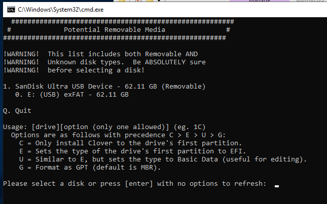
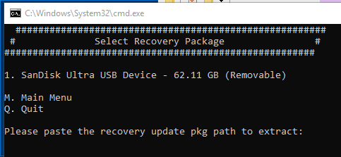
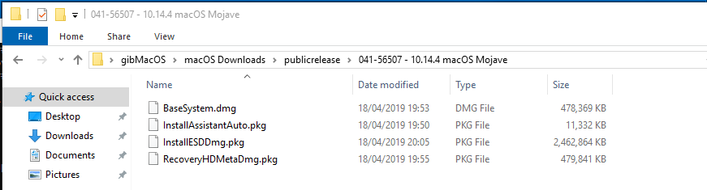
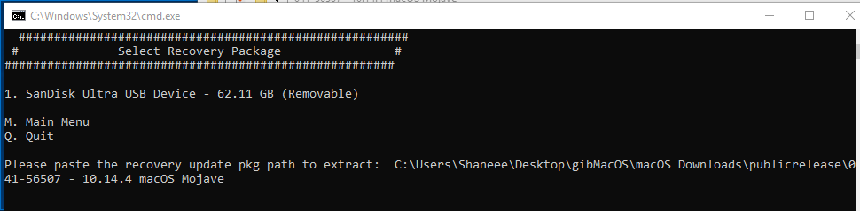
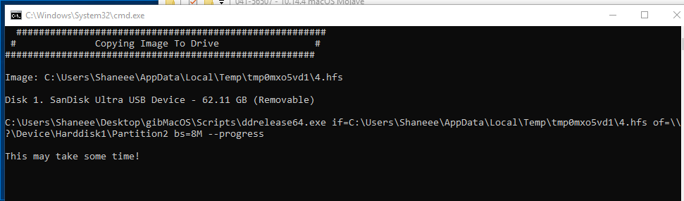
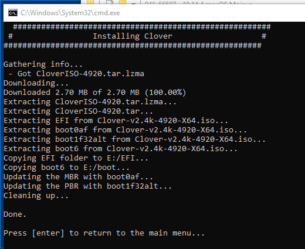

# Creating the macOS Install USB

### 

### Now to create the install USB...

Run MakeInstall from within the gibMacOS folder. Upon first run of the tool it will install the required dependancies to create your installer.

Now when at the main menu select the option number next to your USB device. In my case I only had one connected so I entered 1

On the next screen press "y" then enter to confirm. Once it has selected the drive and formatted it you will be greeted with the next screen,

Simply copy and paste the path to the downloaded files from using the gibMacOS script into the command prompt.

The script will now continue and extract the resources and restore them to USB. This is where you need to be patient!

Once finished it will install the Clover bootloader to the USB.

