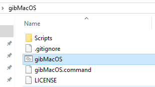
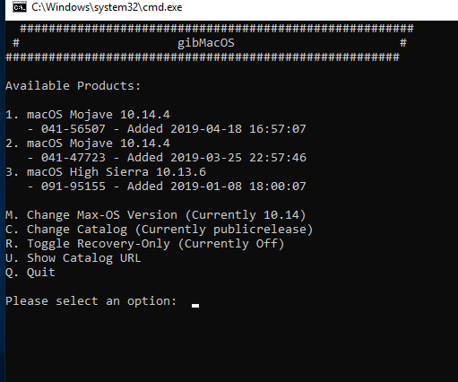
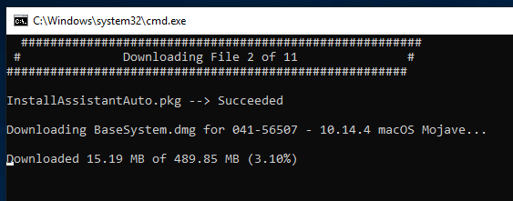
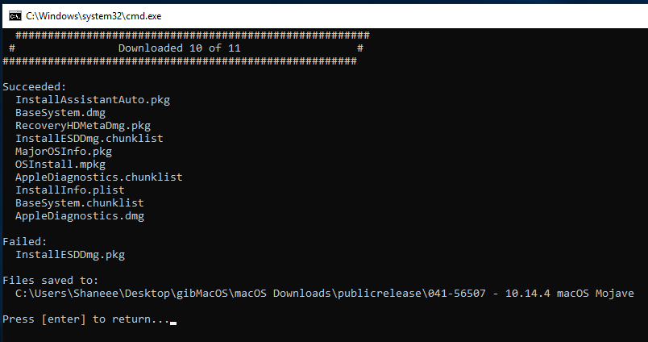

# Getting the macOS Installer

## Get macOS Installer with gibMacOS

Downloading the installer files fairly straight forward process but may take a while depending on your internet speeds.

To start open the gibMacOS folder and run the gibMacOS script,

This will allow you to choose the macOS version to download.

Now type `r` and press enter to enable recovery only mode. \(This will save time downloading\)  
Once selected, which in my case I chose option 1. It will download the macOS installer files.

Once downloaded you can proceed to the next step.

